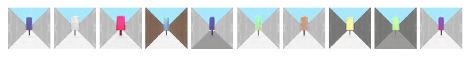
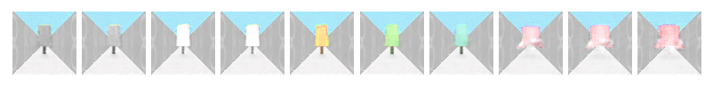
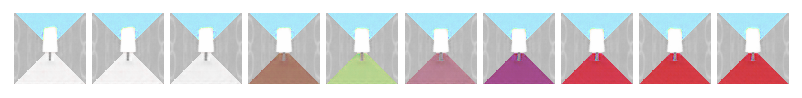

# Readme
* `python train_scan.py --train --load='scan_epoch_1499.pth'`
	* to continue training SCAN
* `python vae_disentangle.py`
	* to see results of disentanglement
* `python train_vae.py --train --load='vae_epoch_2900.pth'` 
	* to continue training VAE model of PART Ⅰ
* `python train_dae.py --train --load='dae_epoch_2900.pth'` 
	* to continue training DAE model of **SCAN**
*  `beta-VAE/Peiyao_Sheng_beta_VAE.ipynb`
	* to check the implementation about **beta-VAE** (on 2D-shape dataset)

# Work Dairy
### SCAN
* to-do-list:
	* implement Recombinator
	
* 0117
	* finish SCAN
	* results:
	
	wall_color = 0  
	wall_color = 0 & floor_color = 0 
	

* 0108
	* finish beta-VAE and disentangled part
	* current results:
		
		z3: color and shape 
		z4: color of floor 
		z15: color of wall
* 0106 Implementing PART Ⅰ with *Pytorch*
	* denoising autoencoder(DAE)
		* continue training process by command
		
			`python train_dae.py --train --load='dae_epoch_2900.pth'`
		* current results:
			
			 
			 target
			 
			reconstruction
	* beta-VAE
		* There is a problem about the reconstruction loss of this part, I'll figure out it soon. [issue](https://github.com/miyosuda/scan/issues/1)

* 0105 Review the paper of SCAN and observe that it includes three parts:
	* PART Ⅰ: beta-VAE to disentangle the primitives
	* PART Ⅱ: SCAN to abstract the concepts
	* PART Ⅲ: Recombinator to create new concepts
	
p.s. I didn't find the original dataset and use [this mimic version](https://github.com/miyosuda/rodent/tree/master/examples/04_texture_replace) to implement models

Some Ref: [TensorFlow Version](https://github.com/miyosuda/scan)

### beta-VAE
* 1219 read papers
    * VAE: framework & overall mathematical idea
    * beta-VAE: framework derivation & disentanglement metric
    * SCAN: disentantglement & hierarchical representation (primitive->concept->relationship)
        * every level implements a different version of VAE
* 1220 Implement Beta-VAE
* 1221 Analyze primitive experiments and write report
* 1222 Analyze the relations between given factors and latent representations z
    * train more epochs(500/1000/2000)
    * draw correlation curves between latent representations and given factors using better model
    * mathematical details of VAE
* 1223 train on more samples

##### More work to be done after Exam Week and Endless Coursework……
* to-do:
    * implement evaluation of disentanglement metric
    * further about SCAN
    
See `beta-VAE/Peiyao_Sheng_beta_VAE.ipynb` for more implementation details.
